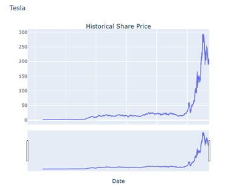
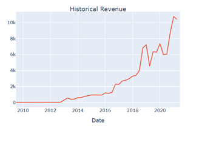
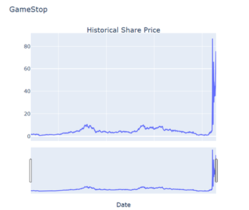
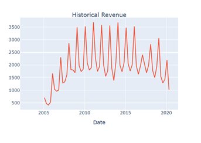

# Tesla_GameStop_Stock_Analysis
_A financial data science project using web scraping (BeautifulSoup), data visualization (Plotly), and stock market APIs (yfinance) to analyze Tesla and GameStop's share prices and revenue trends._

## Project Overview
This project simulates the role of a **Data Scientist / Analyst** at a startup investment firm. The goal is to collect financial data (stock prices and revenues) from public sources, analyze them, and create visual dashboards. The focus is on two popular and volatile stocks: **Tesla** and **GameStop**.

## Methods Used
- Historical share price extraction using `yfinance`
- Quarterly revenue scraping from MacroTrends using `BeautifulSoup`
- Cleaned and structured data using `pandas`
- Visualizations with `plotly` and `plotly.subplots`
- Insights into stock and revenue trends

## Data Sources

- **Historical Stock Prices:** Extracted using `yfinance` (Tesla: TSLA, GameStop: GME).
- **Quarterly Revenue Data:** Scraped from MacroTrends with `requests` + `BeautifulSoup`.

## Sample Visualizations
### Tesla
- Clear upward trend in both stock and revenue post-2019.
      

### Gamestop
- Highlights the 2021 “meme stock” surge, where prices skyrocketed despite flat/declining revenue.
         

## Key Insights  
- Tesla’s revenue growth strongly correlates with long-term stock price increase 📈

- GameStop’s stock showed massive volatility unrelated to revenue, driven by retail trading trends

## How to run this project
1. Clone the repository:
```bash
git clone https://github.com/Shubham-Rathore08/Tesla_GameStop_Stock_Analysis.git
```
2. Install dependencies:
```bash
pip install -r requirements.txt
```
3. Open and run notebooks:
   - Tesla_GameStop_Stock_Analysis.ipynb


## Author & Contact
**Shubham Rathore**
📧 Email: shubhamrathore7078@gmail.com

